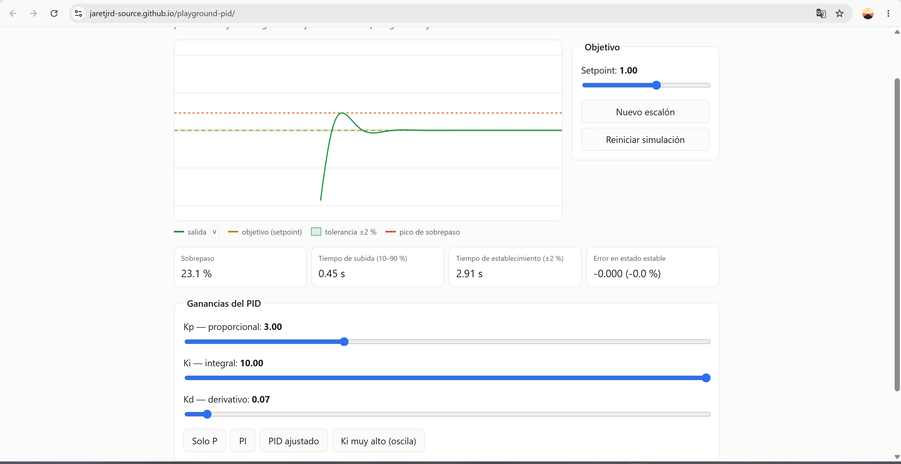

# Playground de control PID

App web interactiva para **entender el control PID jugando**: una planta simulada
(la velocidad de un motor, la temperatura de un objeto…) controlada por un
controlador PID, con deslizadores para `Kp`, `Ki`, `Kd`, presets, y una gráfica
en vivo de la respuesta con sus métricas de desempeño.

**Demo:** https://jaretjrd-source.github.io/playground-pid/



## Qué hace

- **Dos plantas** integradas con Euler:
  - **Primer orden** `dv/dt = (u - v) / tau` — como la velocidad de un motor.
  - **Segundo orden** `v'' = wn²(u - v) - 2·zeta·wn·v'` — como la posición de un
    motor; con `zeta < 1` oscila por sí sola.
- **Lazo cerrado**: `error = setpoint - v` → PID → entrada `u` → planta → repetir.
- Deslizadores para **Kp, Ki, Kd** y para el **setpoint**, con su valor numérico.
- **Presets**: _Solo P_, _PI_, _PID ajustado_, _Ki muy alto (oscila)_.
- Botón **Perturbar**: mete un "golpe" a la salida en vivo para ver al PID
  rechazar la perturbación.
- **Métricas** que se recalculan al vuelo: sobrepaso (%), tiempo de subida
  (10–90 %), tiempo de establecimiento (±2 %) y error en estado estable.
- La gráfica marca la **banda de ±2 %** y el **pico de sobrepaso**.
- **Modo oscuro** automático y **`prefers-reduced-motion`** (dibuja la respuesta
  completa en estático en vez de animarla).

## Cómo correrlo

Requiere [Node.js](https://nodejs.org/) 18 o superior.

```bash
npm install
npm run dev        # servidor de desarrollo en http://localhost:5173
npm run typecheck  # revisa los tipos (tsc --noEmit)
npm run build      # typecheck + genera dist/ para producción
npm run preview    # sirve dist/ para revisarlo
```

## Estructura

| Archivo           | Responsabilidad                                              |
| ----------------- | ----------------------------------------------------------- |
| `src/plant.ts`    | El modelo físico (planta de primer orden).                  |
| `src/pid.ts`      | El controlador PID (términos P, I, D y anti-windup).        |
| `src/metrics.ts`  | Cálculo de las métricas a partir de la respuesta.           |
| `src/plot.ts`     | Dibujo en `<canvas>` (rejilla, setpoint, banda, traza).     |
| `src/main.ts`     | Une todo: bucle de simulación, controles y estado.          |

Cada módulo hace una sola cosa; `plant.ts`, `pid.ts` y `metrics.ts` son funciones
puras y se pueden probar sin navegador.

## Qué aprendí

- **Módulos ES**: separar la simulación, el control, las métricas y el dibujo en
  archivos con `export`/`import` en vez de un solo archivo.
- **`requestAnimationFrame`** para animar sincronizado con la pantalla, y un
  `dt` fijo para que la física no dependa de los FPS.
- Dibujar en **`<canvas>`** con `devicePixelRatio` para que se vea nítido, y leer
  colores desde **variables CSS** para que la gráfica siga el tema.
- Funciones de orden superior (pasar un callback a `crearSlider`), estado
  inmutable vs. mutable (la planta devuelve estado nuevo; el PID acumula).
- Accesibilidad básica: `:focus-visible`, `prefers-reduced-motion`,
  `prefers-color-scheme`, `<fieldset>`/`<legend>`.
- **TypeScript** (fase final): pasar de `.js` a `.ts` con `interface PlantState`,
  `PidGains`/`PidState`, `Metricas`, y tipar `step` / `compute`. Lo que más se
  notó: el compilador obliga a manejar los casos `null` (`getContext`,
  `querySelector`) que en JS pasaban desapercibidos, y `satisfies` + `keyof`
  hacen que los presets no acepten un nombre inventado.
- **Uniones discriminadas**: `PlantState` es `FirstOrderState | SecondOrderState`,
  cada una con un campo `tipo`; `step()` hace `switch` sobre `tipo` y TS sabe qué
  campos existen en cada rama.

## Stack

[TypeScript](https://www.typescriptlang.org/) + [Vite](https://vite.dev/). Sin
frameworks. (Empezó en JavaScript puro y se migró a TS al final.)

---

Segundo proyecto de [@jaretjrd-source](https://github.com/jaretjrd-source) ·
[Portafolio](https://jaretjrd-source.github.io/portafolio/)
